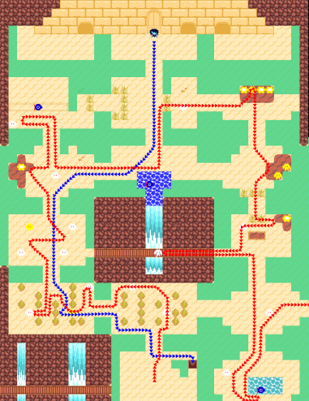
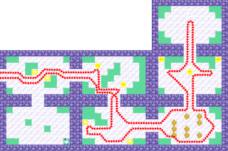
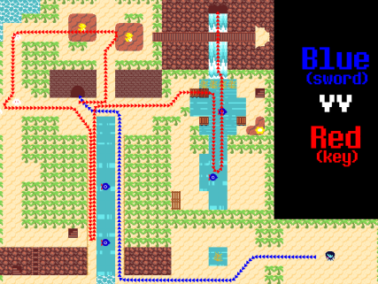
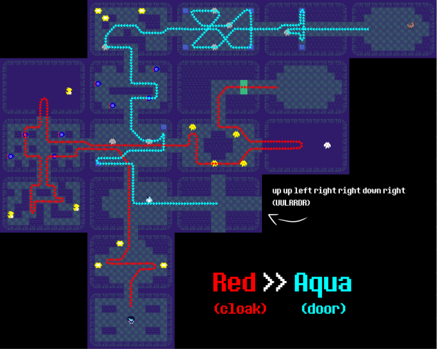
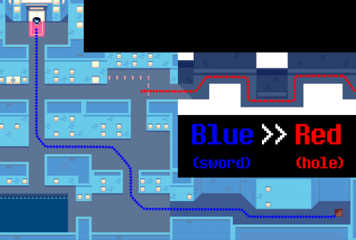
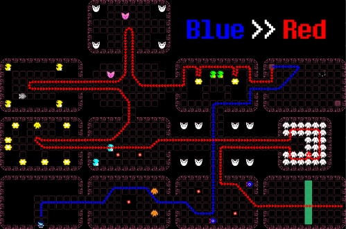
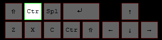

# All Chapters All Bosses Glitchless #

## CH1 - Door ##
- Precheck:
	- OBS Game Capture
	- Check if Recording
	- Check Virtual Cam
	- Ensure that Livesplit Server is up

* Prologue
* Prologue
	* 1: U Z D R D Z
	* 2: R U Z D D Z

--- 
## CH1 - Fields ##
Pick up Top Cake after Rudinn 2

Ralsei Back Turn

Jevil Key 1
- M  R  M  L  R  M  L
- RSR BSB

Rudinn 4

--- 
## CH1 - Checkboard ##
Same as Any%

Get Susie Death!

--- 
## CH1 - Forest ##
Heal at Bake Sale

Grab Jevil Key 2
- <15 HP on both means you're 1 shot
- Grab Revivemint!

Thrash Machine
* Select Flame Head! (Third Choice)

--- 
## CH1 - Escape ##
Cell Actions

- Interact Chain Twice
- Obtain IronShackle

Susie Puzzle

- LEFT, RIGHT, UP, LEFT
--- 
## CH1 - Enter Jevil ##
GO TO JEVIL RIGHT AWAY (Top Elevator Choicer)
Return (Right Elevator Choicer)

Warp Door Order (LUD)
- Field (Left)
- Bake Sale (Up)
- Castle (Down)

--- 
## CH1 - Jevil ##

Hyponesis (BL): 50
Pirouette (TL): 20

**Pirouette** the following
* 1st Carousel Attack
* 2nd Circle Spade Attack

--- 
## CH1 - Castle ##
HHS

GET REVIVEMINT

Buy BraveAx (2nd) & 2 Amber Cards (Bottom)

--- 
## CH1 - King ##

9 Turn (10 if missed)
- Red + Fight Early
- Red + Fight on second box bounce attack

--- 
## End CH1 ##
RUN!

SWAP TO ENGLISH!

--- 
## CH2 - Punch Out ##
Werewire Encounter (TADYWIRE)

- JiggleJiggle (Top, TR), Fight (Bot)
- JiggleJiggle (Top, TR), Spare (Top)
- Fight All

Punch-Out

Minigame

- Left Choicer ("Bosom")

--- 

## CH2 - Berdly 1 ##

- DanceX Middle
- S-Action, R-Action on Top, Bottom

Buy Weapons ($500)

* AutoAx
* MechaSaber

Smorgasboard Cycle Skip (SCS)

* Get TensionBit
* Werewire Skip
* Get Ragger2 (Equip All)

Fight Berdly Optimal
* Fight ALL
* Fight ALL
* Defend, Rude Buster, Pacify

--- 
## CH2 - Mouse Puzzle 2 ##
Obtain Jevilstail & IronShackle from Susie (use Amber Cards)

Mouse 1 Puzzle

- D1, R1, Send

Barrier Equip

- Equip on Barrier Scene
- Kris: IronShackle, Pink Ribbon
- Noelle: Jevilstail

Mouse 2 Puzzle (DDS)

--- 
## CH2 - Spamton ##
Berdly 2 (Unplug Rudy Strat)
- PlaySmart
- Fight, Iceshock (BR) - LOOP

GET JEVILSTAIL OFF NOELLE!!!

Spamton A. Spamton
- 1st: Left
- Rest: Right

--- 
## CH2 - Enter Cage ##
Gifting
- Noelle (top)
- Truce (left)

Equip Jevilstail on Ralsei

Double Ambulance Encounter
- Get Hit
- Spare

Mouse Encounter
- Fight All (CRIT)

--- 
## CH2 - Disk Get ##
Buy KeyGen (TRASH ZONE - TOP)
- Mash for 100 Kromer price
- Buy 4x BSHOT Bowtie

Mansion (LEFT)

Tasque Manager

- Left, Bottom, Left

SPOT

GET THE DISK! (Equip Bowties) 
- RIGHT ROOM!

--- 
## CH2 - Spamton NEO ##

(TRASH ZONE - TOP)
(Mansion - LEFT)

Spamton
- SnapALL (BL)

Equip Change
- Kris: PinkRibbon, FrayedBowtie
- Susie: Jevilstail, Dealmaker
- Ralsei: FrayedBowtie, FrayedBowtie

--- 
## CH2 - Mansion ##
2 Turn MausWheel

Ralsei Dialogue 1
- Left Choicer

Acid Lake
- 2 Maus 1 Maus

Rouxls
- Diagonal
- Solve

Raisei Choicers
- Left All

Lesbian Skip
- All Right Choicer

--- 
## CH2 - Queen ##
Werewire Skip
- BE PATIENT!

AB Queen (6 Turn 1 Shield)
   1 (2 Crit Bank): Fight, Fight, Defend (Graze 50%)
   2 (2 Crit Bank): Fight, RudeBuster, Fight
   3 SD: Fight, RudeBuster, Fight
   4: Fight, Fight Defend
   5: Red Buster Fight

--- 
## CH2 - Giga Queen ##
Round 1
- 1: Fight (Crit)
- 2: Fight (Crit) (leave at low hp)
- 3: Defend (MASH)
Round 2
- 1: Flame Mode
- 2: Fight
Round 3
- 1: Flame Mode (graze to 50)
- 2: Flame Mode (Get hit on Ult)

MISSED BASEBALL SKIP BACKUP
R1
- 1 + 2: Fight
- 3: Mash Fight
R2
- Flame
- Defend
R3
- Flame
- Flame (or Attack)

--- 
## End CH2 ##
Left Choicer on door

New Home
- Mash Sink
- Left Choicer
- Bottom Choicer

---
## CH3 - Board 1 ##
Optimal Path
- Drink the Fountain
- Get Cactus Key
- Quiz (Safety): Mr. Tenna, Marvelous Mystery Board, Lancer
- Buy 3rd Key
- Door (Hold Down After Interact)
- Win the Cooking Show (R for 3 frames)

Lanino/Elnina (R Fast by 1 Frame)
- Def, Def, R-Act. THEN, Def ALL
- Mash C on Turns: 3, 5, 6, Final

Shadowguys Encounter (66 TP)
- Defend, S-Action, Pacify x2

--- 
## CH3 - Sword 1 ##
Buy the following: 
- LodeStone x3 ($880 DD)
- POINTS in S-Rank

Interact with RAMB from the left

Kill Route
- Up, Left, Up, Up, Lancer (UP)
- Down, Right, Up, Right, Down, Down, Bridge (Left)
- Bridge, Right, Down, Down, Up, Right, Cactus

--- 
## CH3 - Board 2 ##
Get A Rank for TensionGem

Optimal Path
- Camera, Cactus, Right Spawn
- Puzzle

- Deodorant is faster by 0.5 secs
- "I want everything back to normal" (R Choicer)
- Flower, Red Horns, Raft

Encounters
- Pippins: Spare, S-Act, R-Act x3
- Shuttah: SpareAll x3; Spare, Space, Def

--- 
## CH3 - Sword 2 ##
Board 2

Raft
- Left (6x)
- Up-Left (2-Left)
- Up (Space between LV-Bar & Key)

Board 2D

- Noelle Hallway: UULRRDR

--- 
## CH3 - Xbox turn off! ##
Zapper: Right Choicer x2
- Buy: All Weapons + TV SLOP

Code 1: 213
Ralsei: Top Choicer
Code 2: 1225

Board 3
- Mash Quizzes 
- ShadowGuy: SharpShoot (BL) then Tenna only
- Zapper: VolumeUp (TR), TurnOff (BR)

--- 
## CH3 - TV World ##
Quiz 1: B, A

Shadowguy/PippinsX2
- Defend, S-Act, Pacify
- Spare, S-Act, R-Act x2

Raibbick 
- CroakOn, S-Act, Spare

Zappers Room Quizzes: Bottom, Top , Top

Rouxls
- Hit 5/6 Lancers
- Get hit on yarn attack to encounter skip
- Mash Text after cutscene

Tenna Door: 000000

--- 
## CH3 - Sword 3 ##
Board 4

Sword 3D

--- 
## CH3 - Mantle Strikes Back!##
Don't Interact with Manhole

Don't Die. Don't Greed. LIVE!

--- 
## CH3 - Tenna Deez ##
EQUIP
- Kris: Saber10, PinkRibbon, LodeStone
- Susie: ToxicAxe, JevilsTail, DealMaker
- Ralsei: FlexScarf, LodeStone, LodeStone

Fight, Fight, Fight
Fight, Rude Buster (BL), Fight
Get hit once on 'turn 2'

--- 
## End CH3 ##
UNSTICKY SHIFT

--- 
## CH4 - Enter Study ##
Piano 1: ←  ↓  ←  ↓  ←  →
- LDLDLR

Skip 1

2nd Encounter is skipped by holding DOWN around middle 

Piano 2: ↑  ↑  ↓  ↓  ←  ←  →  ↑
- UUDDLLRU

--- 
## CH4 - YOUR LONG! ##
Piano: ←  ↓  ←  →  ↓  ↓  →  →
- LDLRDDRR 
- SAVE

Jackenstein

- Brighten: 60 TP
- Collect ALL
- Use TensionGem + TensionBit
- Scaredy Cat Strat 

- Stop using Scardy Cat after going up the chimney

--- 
## CH4 - Hammer of Justice ##
Piano: ↑  N  ↑  ←  ↓  N  →  N  →  ↓  ←  N
- U N U L D N R N R D L N

The Fight
- Steps: AAA, H, AA, H, ARA, H, AA, H, A
- Kindergarten: Take DMG on First Attack

--- 
## CH4 - Seal Fountain 1 ##
Climb to Right Side 2nd Waterfall
- Get TensionGem

---
## CH4 - The Fall ##
Don't Die.

--- 
## CH4 - Seal Fountain 2 ##
Winglade Encounter
- FIGHT

Fake Gerson

- Right Choicer for hearing test
- Kill Susie
- USE TENSIONGEM
- BetterHeal (TR): 78% TP
--- 
## CH4 - Start Titan ##
Jackenstein Climbing
- Tap 'up'
Titan Spawn Encounter
- Healed before and after

Encounters
===
Book, Winglade:
- SpinS (B), R-Action (B)
- Spare, Spare, R-Action (T)
Organikk x2 [Dark Room] (if missed skip):
- Tune x2 (B), R-Action (T)
- Perform (M), S-Action (T), Spare
- Spare, Spare, Defend
Titan Spawn
- KILL

--- 
## CH4 - Titan Fight ##
Titan Fight (FIGHT METHOD)

Unleashed (BR): 80 TP 

Brighten Ques
- TURN 3

- TURN 11 (AFTER 2 LARGE FISHIES)

--- 
## End CH4 ##
Poor Ralsei :(

--- 