# All Chapters Main Route Glitchless #

## CH1 - Door ##
- Precheck:
	- OBS Game Capture
	- Check if Recording
	- Check Virtual Cam
	- Ensure that Livesplit Server is up
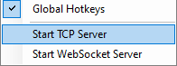
* Prologue
	* 1: U Z D R D Z
	* 2: R U Z D D Z

--- 
## CH1 - Fields ##
Triple Hathy Encounter
- Act (get hit)
- Spare, Defend
- Spare, Spare

Clock Puzzle

Ralsei Back Turn
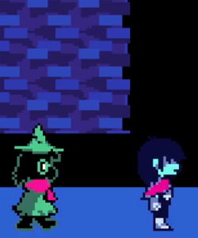

Triple Barry Encounter
- Fight, Fight
- Act, Spare

Rudinn4

--- 
## CH1 - Checkboard ##
* Good Movement

Susie Death
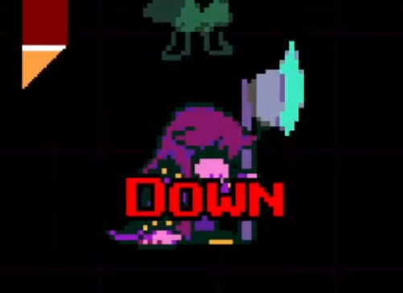

--- 
## CH1 - Forest ##
Fuck you YZA!

Flame Head! (Third Choice)
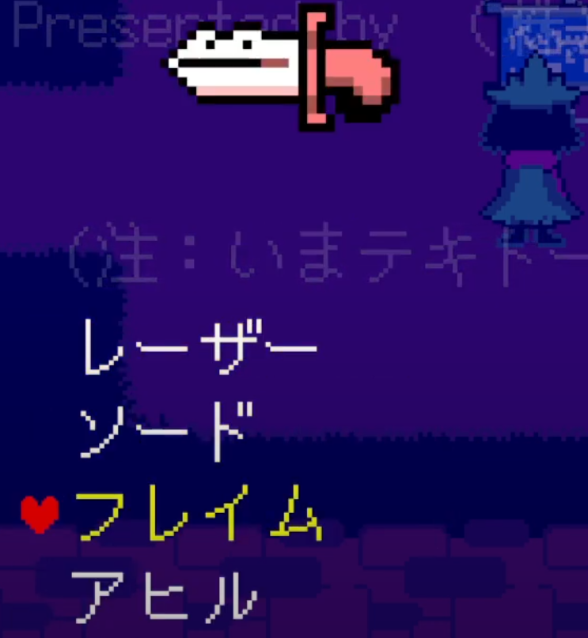
First Bloxer Skip

Second Bloxer Skip
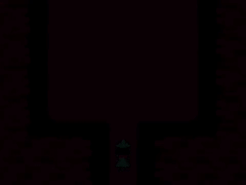

--- 
## CH1 - Escape ##
Cell Actions

- Interact Chain Twice
- Obtain IronShackle

Susie Puzzle
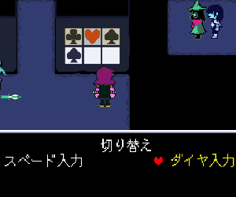
- LEFT, RIGHT, UP, LEFT

--- 
## CH1 - Castle ##
Head Hathy Skip

Get Revivemint ($200)
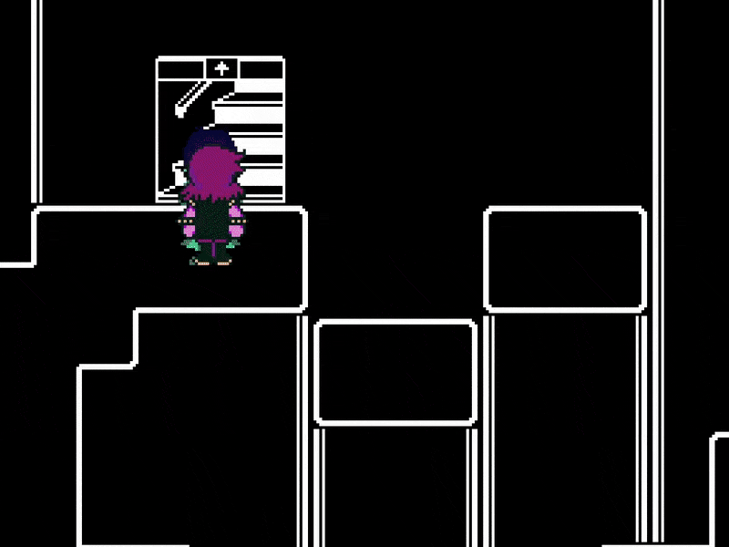
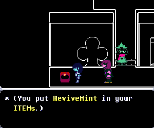

BUY AXE
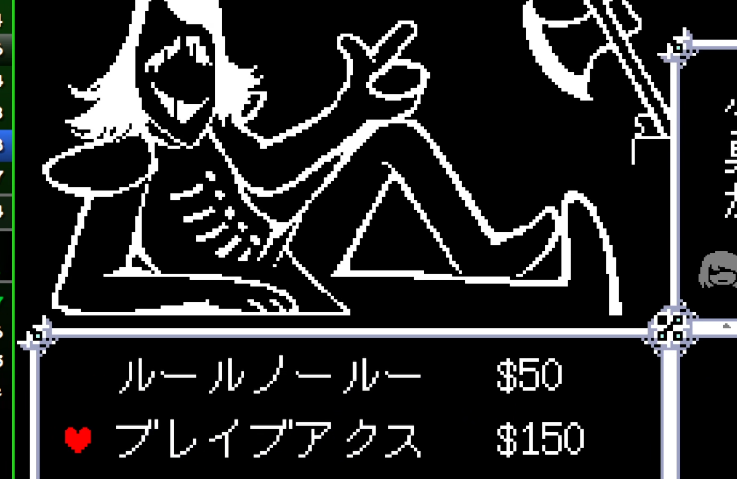

--- 
## CH1 - King ##
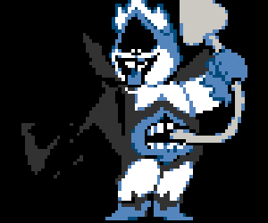
Five Red (10-Turn)
- 2 Fights
- 5 Red Busters (60 TP)

--- 
## End CH1 ##
RUN!

WR (NERS) has a 26:02.670 for CH1

SWAP TO ENGLISH!

--- 
## CH2 - Punch Out ##
SWAP TO ENGLISH!

Werewire Encounter (TADYWIRE)

- JiggleJiggle (Top, TR), Fight (Bot)
- JiggleJiggle (Top, TR), Spare (Top)
- Fight All

Punch-Out
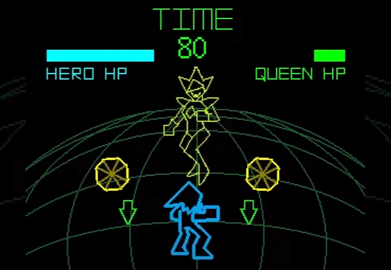

Post-Minigame
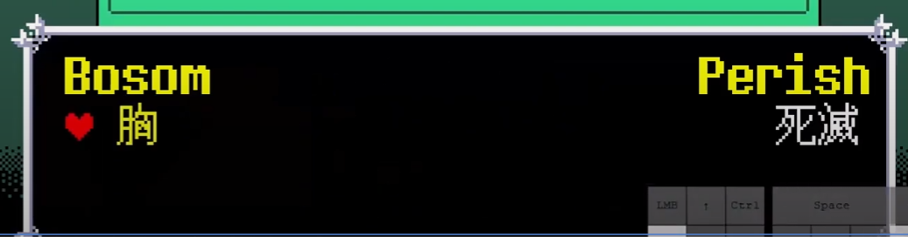
- Left Choicer ("Bosom")

--- 
## CH2 - Berdly 1 ##
DJ Fight

- DanceX Middle
- S-Action, R-Action on Top, Bottom

Buy Weapons ($500)
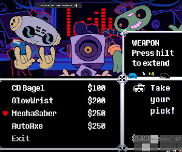
- AutoAx
- MechaSaber

Smorgasboard Cycle Skip (SCS)

* Get TensionBit
* Werewire Skip
* Get Ragger2 (Equip All)

Fight Berdly Optimal
* Fight ALL
* Fight ALL
* Defend, Rude Buster, Pacify

--- 
## CH2 - Mouse Puzzle 2 ##
Mouse 1 Puzzle
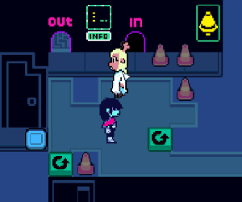
- D1, R1, Send

Viro Encounter
- TakeCare (TR), Spare

Pink Ribbon
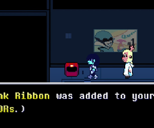

Barrier

- Equip on Barrier Scene

Werewire Skip
- Stay Top

Mouse 2 Puzzle

--- 
## CH2 - Spamton ##
Berdly 2 (Unplug Rudy Strat)
- PlaySmart
- Fight, Iceshock (BR) - LOOP

Spamton A. Spamton
- 1st: Left
- Rest: Right

--- 
## CH2 - Enter Cage ##
Gifting
- Noelle (top)
- Truce (left)

Double Ambulance Encounter
- Get Hit
- Spare

Mouse Encounter
- Fight All

--- 
## CH2 - Mansion ##
Tasque Manager
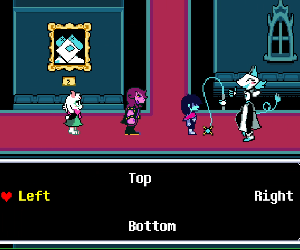
- Left, Bottom, Left

Platter: CLOCK-WISE
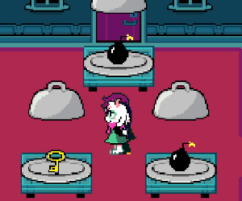

Mauswheel: CatchX (BL)
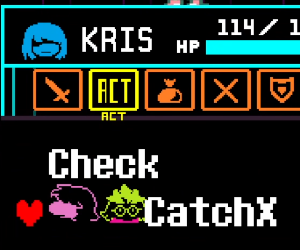

---
## CH2 - Acid Lake ##
2 Maus 1 Maus

Ralsei Dialogue 1: Left Choicer

Rouxls
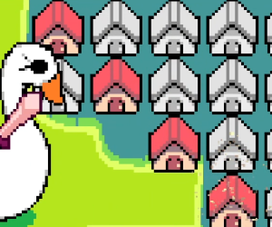
Solutions
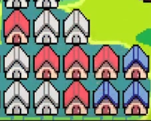
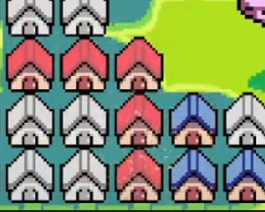
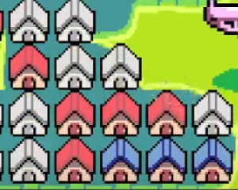
Raisei Camera: Left Choicer
Lesbian Skip: All Right Choicer

--- 
## CH2 - Queen ##
Werewire Skip
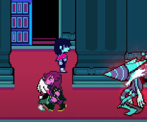

Safe 6-1 Queen
   1: Fight All (MISS 1+)
   2: Defend All
   3: RedBuster, Fight (Def if Miss 1)
   4: [Shd] RBuster, Fight (CRIT!)
   5: Fight, Fight, Defend (No Crit)
   6: RedBuster, Fight (CRIT!)

--- 
## CH2 - Giga Queen ##
Round 1
- 1: Fight (Crit)
- 2: Fight (Crit) (leave at low hp)
- 3: Defend

Round 2
- 1: Flame Mode
- 2: Fight

Round 3
- 1: Flame Mode (graze to 50)
- 2: Flame Mode (Get hit on Ult)

--- 
## End CH2 ##
THE ROARING THE ROARING THE ROARING THE ROARING THE ROARING THE ROARING THE ROARING THE ROARING THE ROARING THE ROARING THE ROARING THE ROARING THE ROARING THE ROARING THE ROARING THE ROARING THE ROARING THE ROARING THE ROARING THE ROARING THE ROARING THE ROARING

---
## CH3 - Board 1 ##
Optimal Path
- Drink the Fountain
- LANCER
- Get Cactus Key
- Buy 3rd Key
- Door (Hold Down After Interact)
- Win the Cooking Show (R for 3 frames): PRESS W

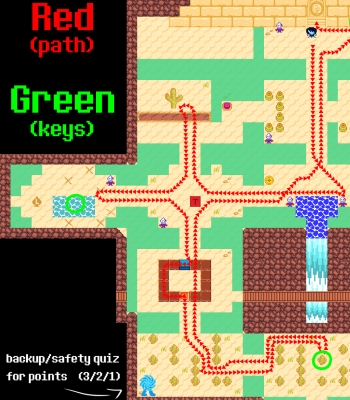

Lanino/Elnina (R Fast by 1 Frame)
- Def, Def, R-Act. THEN, Def ALL
- Mash C on Turns: 3, 5, 6, Final

Shadowguys Encounter
- Defend, S-Action, Pacify x2

--- 
## CH3 - Board 2 (A-RANK) ##
Buy LodeStone x4 ($880 DD) and Equip
- Kris: PinkRibbon, LodeStone
- Susie: IronShackle, LodeStone
- Ralsei: LodeStone, LodeStone

Get Started (ALL RIGHT CHOICERS)
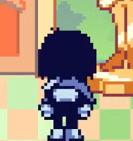

Optimal Path
- Camera, Cactus, Right Spawn
- Puzzle
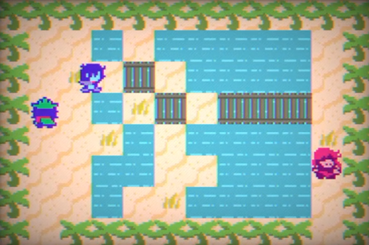
- Deodorant is faster by 0.5 secs
- "I want everything back to normal" (R Choicer)
- Flower, Red Horns, Raft

Encounters
- Pippins: Spare, S-Act, R-Act x3
- Shuttah: SpareAll x3; Spare, Space, Def

--- 
## CH3 - Xbox turn off! ##
PICK UP TENSION GEM
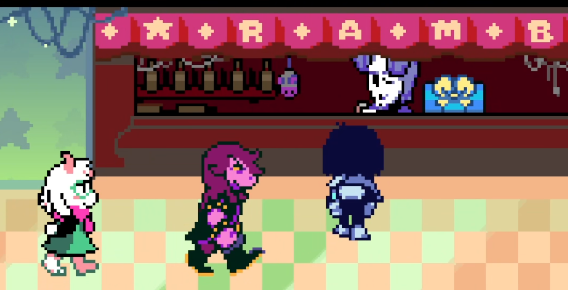

Zapper: Right Choicer x2

- Buy: Saber10, ToxicAxe
- EQUIP for KRIS & Susie

Code 1: 213
Ralsei: Top Choicer
Code 2: 1225

Mash Quizzes

ShadowGuy: SharpShoot (BL) then Tenna only
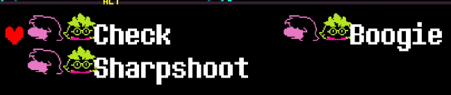

Zapper: VolumeUp (TR), TurnOff (BR)
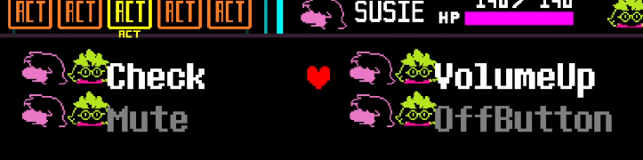

--- 
## CH3 - TV World ##
Quiz 1: B, A

ShadowGuy/PippinsX2
- Defend, S-Act, Pacify
- Spare, S-Act, R-Act x2

Ribbick Skip: Do a < around trash can
- CroakOn (TR), S-Act, Spare

Zappers Room Quizzes: Bottom, Top , Top

Rouxls
- 1 Lancer: MASH
- Get Yarned
- Mash AFTER scene

Tenna Door: 000000

--- 
## CH3 - Tenna Deez ##

All Turns: ILoveTV (BOT BL, S-Act, R-Act)

Get hit once on 'turn 2'

Get Low on Final

--- 
## End CH3 ##
Die to Knight LMAO

SPARE if 40> HP

--- 
## CH4 - Enter Study ##
Piano 1: ←  ↓  ←  ↓  ←  →
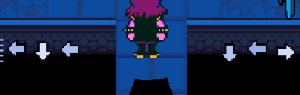

Double Guei 
- Exercist (Bot, TR), S-Action, R-Action
- Spare, S-Action, Pacify (16 TP, TR)

Skip 1
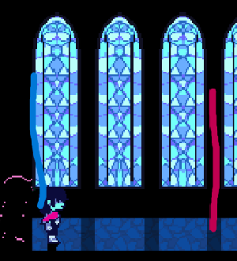

Double Balthizard
-  Shake, S-Action, Spare

Piano 2: ↑  ↑  ↓  ↓  ←  ←  →  ↑
- UUDDLLRU

--- 
## CH4 - YOUR LONG! ##
Piano: ←  ↓  ←  →  ↓  ↓  →  →
- LDLRDDRR 
- SAVE

Jackenstein
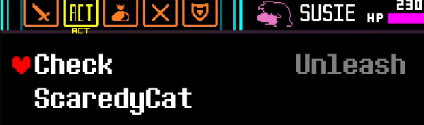
- Brighten: 60 TP
- COLLECT EVERYTHING
- Use TensionGem + TensionBit

STOP SCAREDYCAT QUE

- STOP using Scardy Cat after going up the chimney

--- 
## CH4 - Seal Fountain 1 ##
Climb 1
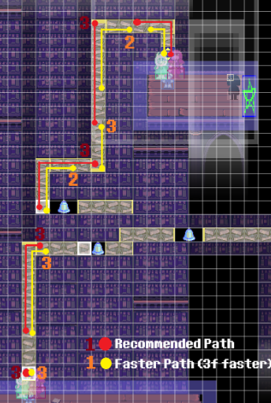

Climb 2
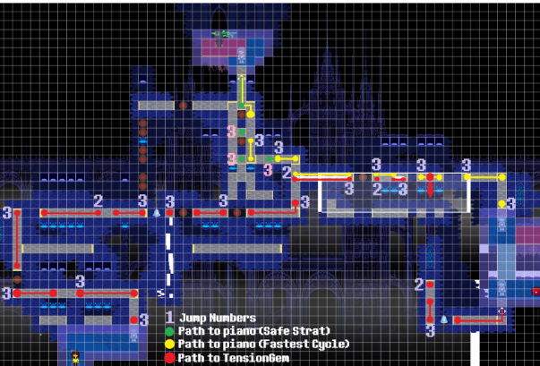
- Get TensionGem

Piano Book Choicers: R, R, L

Mizzle Encounter
- Def, Def, Pacify
- Embezzle, Pacify

Climb3
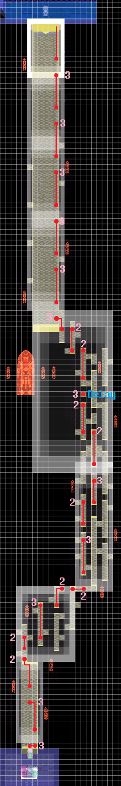

--- 
## CH4 - Fall Off##
Winglade Encounter
- SpinS (BL) x2
- Spare x2

Wicabel Encounter
- Tune (TR) x2
- Spare 

Climb 4

---
## CH4 - Seal Fountain 2 ##
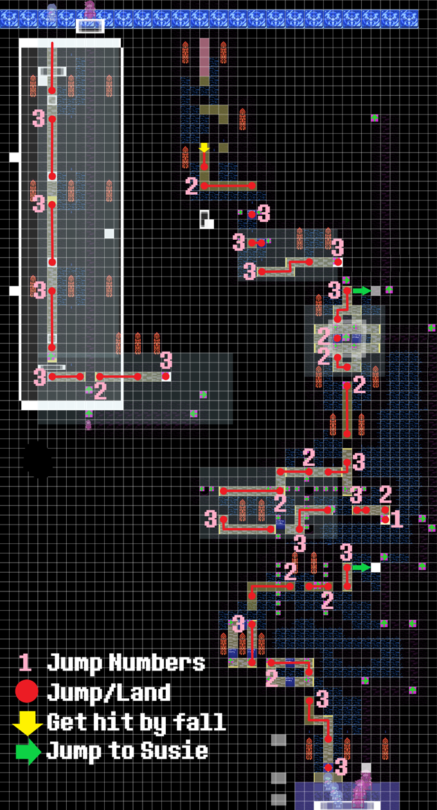

Fake Gerson
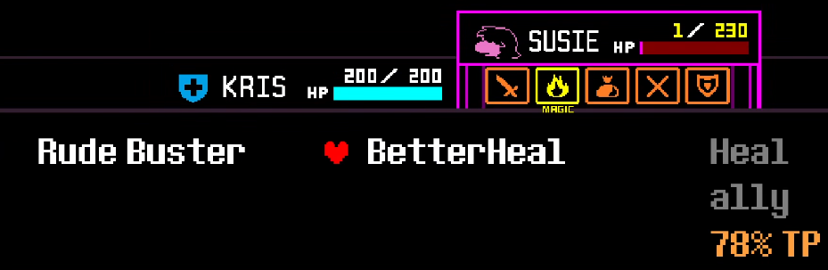
- Right Choicer for hearing test
- Kill Susie
- TensionGem
- BetterHeal (TR): 78% TP

--- 
## CH4 - Start Titan ##
Book, Winglade:
- SpinS (B), R-Action (B)
- Spare, Spare, R-Action (T)

Jackenstein Climbing
- Tap 'up'

Organikk x2 [Dark Room] (if missed skip):
- Tune x2 (B), R-Action (T)
- Perform (M), S-Action (T), Spare
- Spare, Spare, Defend

Titan Spawn Encounter
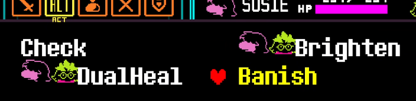
- Healed before and after
- Banish (BR): 64 TP

--- 
## CH4 - Titan Fight ##
Titan Fight (FIGHT METHOD)

Unleashed (BR): 80 TP 
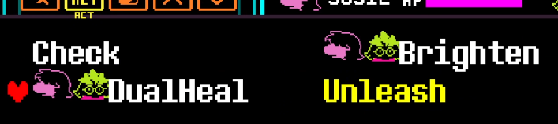

Brighten Ques
- TURN 3
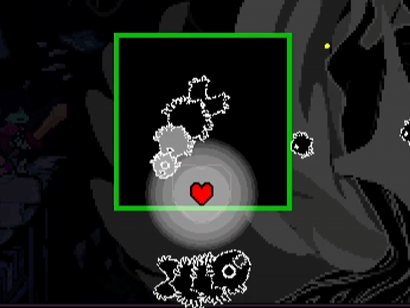
- TURN 11 (AFTER 2 LARGE FISHIES)
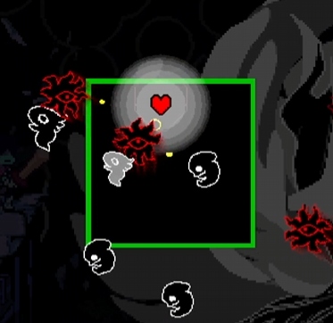
--- 
## End CH4 ##
Poor Ralsei :(

--- 