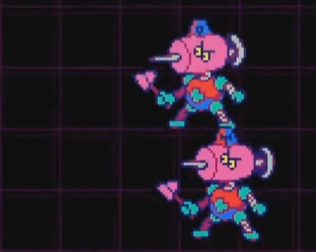
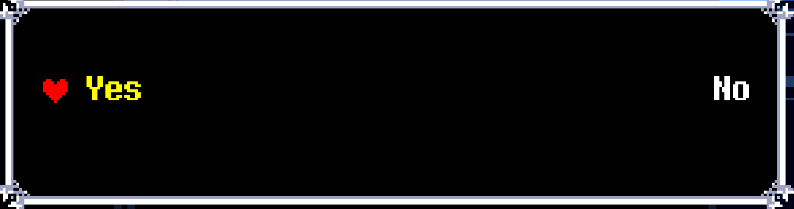
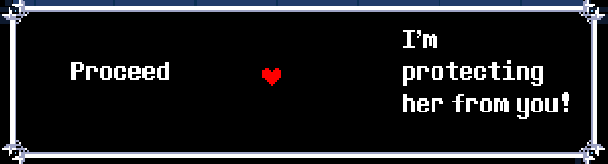
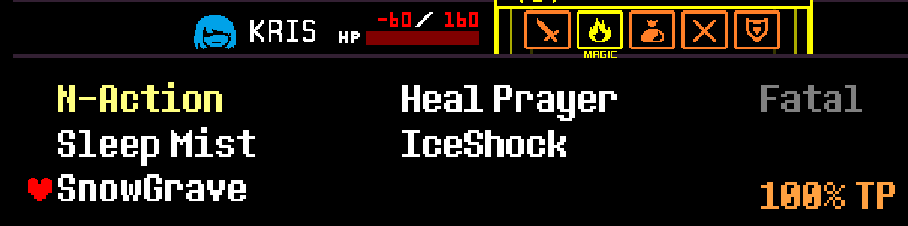
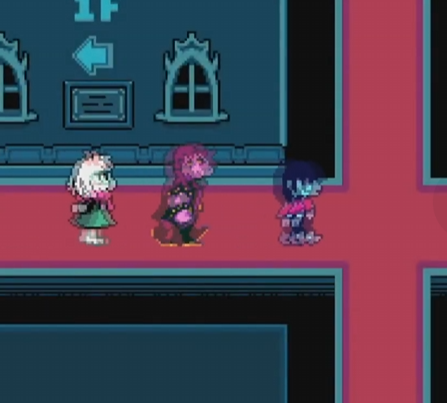
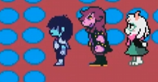
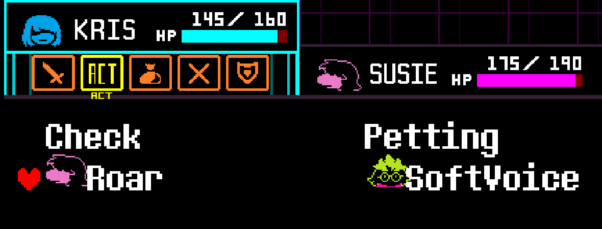

<!-- Savestates
0: Tadywire
1: Punch-Out
3: Smorgasboard Cycle Skip (SCS)
4: Berdly 1
5: Cyber City 1
6: Equip Pink Ribbon + Freeze Ring (Cyber City 2)
7: Equip ThornRing
8: Mansion
9: Spamton NEO -->
## CH2 - Punch Out ##
Werewire Encounter (TADYWIRE)

- JiggleJiggle (Top, TR), Fight (Bot)
- JiggleJiggle (Top, TR), Spare (Top)
- Fight All

Punch-Out

Post-Minigame

- Left Choicer ("Bosom")

--- 
## CH2 - Berdly 1 ##
DJ Fight

- DanceX Middle
- S-Action Top, R-Action on Bottom

Sell 2x AmberCard, Buy MechaSaber ($250)

Smorgasboard Cycle Skip (SCS)

Fight Berdly Optimal
* Fight ALL x3
* Defend, Rude Buster, Pacify

--- 
## CH2 - Freeze Ring ##
Mouse 1 Puzzle

- D1, R1, Send
Fight, Fight Crit+ IceShock 

Mash Fight, Fight Crit + Ice Shock

Freeze Ring Choicers

--- 
## CH2 - Thorn Ring ##
Barrier

Mouse Puzzle 3

Thorn Ring

Berdly

SnowGrave

--- 
## CH2 - Mansion ##
PRESS 'C' ON MAUS WHEEL

Maze

Tasque Manager 
- ACT (1st Enemy), Defend
- Spare (2nd Enemy)

--- 
## CH2 - Spamton NEO ##
After Turn 2, use Big Shot SPAM

---
## CH2 - Freedom ##
Left Choicer on door

New Home
- Mash Sink
- Left Choicer
- Bottom Choicer
--- 
