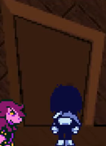

JP is 0.933 seconds faster
Glitched is ~30 secs faster
## CH3 - Board 1##
Optimal Path
- Drink the Fountain
- Get Cactus Key
- Quiz (Safety): Mr. Tenna, Marvelous Mystery Board, Lancer
- Buy 3rd Key
- Door (Hold Down After Interact)
- Win the Cooking Show (R for 3 frames)

Lanino/Elnina (R Fast by 1 Frame)
- Def, Def, R-Act. THEN, Def ALL
- Mash C on Turns: 3, 5, 6, Final

Shadowguys Encounter
- Defend, S-Action, Pacify x2
---
## CH3 - Sword 1 - Ice Key ##
Buy the following: 
- LodeStone x4 ($880 DD)
- Pink Ribbon (S-Rank RAMB)

Interact with RAMB from the left

Kill Route
- Up, Left, Up, Up, Lancer (UP)
- Down, Right, Up, Right, Down, Down, Bridge (Left)
- Bridge, Right, Down, Down, Up, Right, Cactus

---
## CH3 - Board 2 - Paradise ##
Interact Slide
- Get to Pixel

- Build Speed
- Mash Z, Enter (Right Choicer)

Optimal Path
- Camera, Cactus, Right Spawn
- Puzzle

- Deodorant is faster by 0.5 secs
- "I want everything back to normal" (R Choicer)
- Flower, Red Horns, Raft

Encounters
- Pippins: Spare, S-Act, R-Act x3
- Shuttah: SpareAll x3; Spare, Space, Def
---
## CH3 - Sword 2 - Shelter Key ##
Board 2

Raft
- Left (6x)
- Up-Left (2-Left)
- Up (Space between LV-Bar & Key)

Board 2D

- Noelle Hallway: UULRRDR

---
## CH3 - Xbox Turn Off! ##
Zapper: Right Choicer x2
- Buy: All Weapons + TV SLOP

Code 1: 213
Ralsei: Top Choicer
Code 2: 1225

Board 3
- Mash Quizzes 
- ShadowGuy: SharpShoot (BL) then Tenna only
- Zapper: VolumeUp (TR), TurnOff (BR)
---
## CH3 - TV World ##
Wrong Warp Save room
Quiz 1: B, A
ShadowGuy/PippinsX2
- Defend, S-Act, Pacify
- Spare, S-Act, R-Act x2
Stealth Skip: 
- Pixel, Hold Right, Open menu on scene, Hold up

Ribbick Skip: Do a < around trash can
- CroakOn (TR), S-Act, Spare
Zappers Room Quizzes: Bottom, Top , Top
Rouxls
Tenna Door: 000000

Rouxls
- 1 Lancer: MASH
- Get Yarned
---
## CH3 - Sword 3 ##
Board 4

Sword 3D

---
## CH3 - Mantle ##
Don't Die. Don't Greed. LIVE!

---
## CH3 - Tenna ##
EQUIP
- Kris: Saber10, PinkRibbon, LodeStone
- Susie: ToxicAxe, ShadowMantle, LodeStone
- Ralsei: FlexScarf, LodeStone, LodeStone

Fight, Fight, Fight
Fight, Rude Buster (BL), Fight

---
## CH3 - The Knight ##
UNSTICKY SHIFT

Risky (No Ribbon)
- Turn 1 - Fight All
- 95+ TP: Fight, Rude Buster, Fight
- Else: Def, Rude Buster, Der

Safe (Ribbon)
- Turn 1 - Hold Breath, Def, Def
- Def, Rude Buster, Def
---
## CH3 - The End ##
Hold Right, then AFK

---